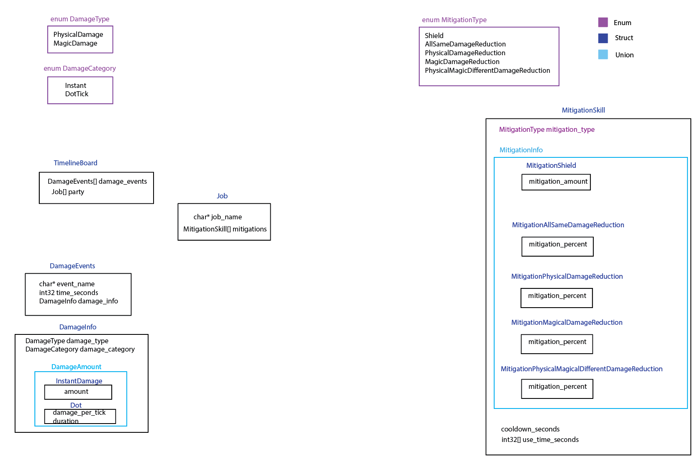

Figures out correct mitigations for your party composition

Input: Timeline 

Initial implementation:




## Input Format

* input.txt

```
[{Party member jobs}]
{tank HP} {non-tank HP}
[{time_mm:ss} [{Damage Info}]]

Damage Info:
{Damage Event Name} {Physical|Magic} {Raidwide|Tanksolo|Tankshare} Dottick {raw_damage_per_tick} {duration_seconds} or
{Damage Event Name} {Physical|Magic} {Raidwide|Tanksolo|Tankshare} Instant {raw_damage}


ex) 
WAR GNB WHM SCH MNK NIN BRD PCT
240000 120000
Phylas_Morphic 00:11 Magic Raidwide Instant 105022
Tank_Buster_Dot 00:15 Magic Tankshare Dottick 10222 30
Tank_Buster_Instant 00:15 Magic Tankshare Instant 103020
```

